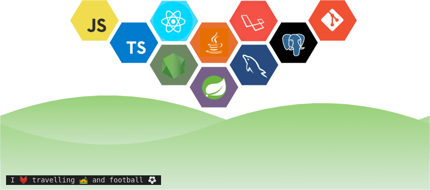

 <!--  
  -->
  

<!-- <h1 align="center">Hello <𝚌𝚘𝚍𝚎𝚛𝚜/>!, I'm <a href="https://www.youtube.com/watch?v=cY4nGCw-JxY"> Lakhan Gurjar </a></h1>

  

 -->

 

 

 

## 𝐇𝐞𝐥𝐥𝐨 𝐭𝐡𝐞𝐫𝐞, 𝐟𝐞𝐥𝐥𝐨𝐰 <𝚌𝚘𝚍𝚎𝚛 />! 

 
 
 
 
 

<!--  -->
<!-- 
 
 -->

  

<!--Cool Gif-->

<!--  -->

<!--Cool Gif/-->

<!--About-->
### Quick facts:
- 👨‍💻 I am currently pursuing B.Tech CSE'27.
   
- :zap: I’m currently learning `Java` and `Python`.
   
- 📚 I’m currently learning **Data Structure and algorithms**.
   
- 🎯 I’m focusing on **Web Development**.
 

 

### Quote ✍️

### Contact me 📫

  
  
<!--    -->
   
 

  

###  My Tech Toolbox 🧰

<!--   <code></code>  -->
  <code></code>
  <code></code> 
  <code></code> 
  <code></code> 
<!--   <code></code>  -->
  <code></code> 
  <code></code> 
<!--  <code></code>  -->
<!--   <code></code> -->
  
  

   
    
###  GitHub Trophies 🏆

  

 
 

  
📈 More Stats

   
 

 <a href="https://github.com/Lakhan-Gurjar"> 
   

  
  
 </a>

  
    
  
 

 

<!--      
      -->
</a>  
 

 

⏳  𝚈𝚘𝚞 𝚑𝚊𝚟𝚎 𝚜𝚝𝚊𝚢𝚎𝚍 𝚘𝚗 𝚖𝚢 𝚙𝚛𝚘𝚏𝚒𝚕𝚎 𝚏𝚘𝚛 ◔_◔ ⌛
  

 

 <!--MOON-->
 
<a href="https://github.com/Lakhan-Gurjar"> 
  
<a href="https://github.com/Lakhan-Gurjar"> 
  

 

 <h4 align="center">Hey,Wait! 👋 don't forget to check out my social media handles </h4>

  <code></code>  
<!--   <code></code> -->
  <code></code>
  <code></code> 
  

 

